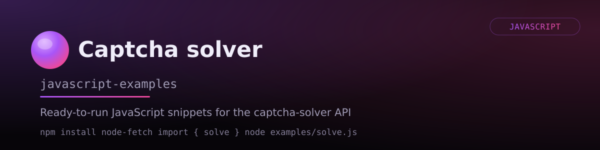

# Captcha Solver API JavaScript Examples



A collection of examples for interacting with the [Captcha Solver](https://captcha-solver.com/) service using Node.js.

This project demonstrates how to send HTTP requests to the API for solving CAPTCHA challenges. You will find examples for reCAPTCHA v2, reCAPTCHA v3, Cloudflare Turnstile, Yandex SmartCaptcha, GeeTest, Tencent, and image-based tasks. The code helps automate task creation, status polling, and result retrieval.

## Table of Contents

- [Installation](#installation)
- [Quick Start](#quick-start)
- [Project Structure](#project-structure)
- [Supported CAPTCHA Types](#supported-types)
- [Usage Examples](#usage-examples)
  - [reCAPTCHA v2](#recaptcha-v2)
  - [reCAPTCHA v2 Enterprise](#recaptcha-v2-enterprise)
  - [reCAPTCHA v3](#recaptcha-v3)
  - [Cloudflare Turnstile](#cloudflare-turnstile)
  - [Yandex SmartCaptcha](#yandex-smartcaptcha)
  - [Image to Text](#image-to-text)
  - [Coordinates](#coordinates)
  - [GeeTest v3](#geetest-v3)
  - [GeeTest v4](#geetest-v4)
  - [Tencent](#tencent)
  - [Check Balance](#check-balance)
  - [Custom Timeout and Polling](#custom-timeout-and-polling)
  - [Error Handling](#error-handling)
- [Requirements](#requirements)
- [API Documentation](#api-documentation)
- [License](#license)

---

## Installation

Clone the repository:

```bash
git clone https://github.com/captcha-solver-api/javascript-examples.git
cd javascript-examples
```

Install dependencies:

```bash
npm install
```

Create a `.env` file in the root directory:

```text
CAPTCHA_API_KEY=your_api_key
```

Run an example:

```bash
node examples/recaptcha_v2.js
```

---

## Quick Start

This single example solves a reCAPTCHA v2. `solveCaptcha` creates the task, polls until it is ready, and returns the solution.

```javascript
const { solveCaptcha } = require('./utils/client');

async function main() {
    const solution = await solveCaptcha({
        type: "RecaptchaV2TaskProxyless",
        websiteURL: "https://example.com/login",
        websiteKey: "SITE_KEY"
    });

    if (!solution) {
        process.exit(1);
    }

    console.log(solution.gRecaptchaResponse);
}

main();
```

---

## Project Structure

All request, error checking and polling logic lives in [`utils/client.js`](utils/client.js), so the examples only describe the task itself.

```text
examples/   One runnable example per captcha type
utils/
  client.js   API helpers: createTask, getTaskResult, waitForResult, solveCaptcha, getBalance
  config.js   API base URL, API key, polling defaults
```

`utils/client.js` exports:

| Function | Description |
|---|---|
| `solveCaptcha(task, options?)` | Creates a task and waits for the solution. Returns the solution object, or `null` on error/timeout. |
| `createTask(task)` | Creates a task. Returns the task ID, or `null` on error. |
| `getTaskResult(taskId)` | Single status check. Returns the full response body, or `null` on error. |
| `waitForResult(taskId, options?)` | Polls `getTaskResult` until the task is ready. Returns the solution object, or `null` on error/timeout. |
| `getBalance()` | Returns the current account balance, or `null` on error. |

Every helper checks `errorId` and logs a description, so examples never need their own error branches.

---

## Supported Types

| Type | Proxyless | With Proxy | Example |
|---|---|---|---|
| reCAPTCHA v2 | ✅ | ✅ | [recaptcha_v2.js](examples/recaptcha_v2.js) |
| reCAPTCHA v2 Enterprise | ✅ | ✅ | [recaptcha_v2_enterprise.js](examples/recaptcha_v2_enterprise.js) |
| reCAPTCHA v3 | ✅ | ❌ | [recaptcha_v3.js](examples/recaptcha_v3.js) |
| Cloudflare Turnstile | ✅ | ✅ | [turnstile.js](examples/turnstile.js) |
| Yandex SmartCaptcha (token) | ✅ | ✅ | [yandex_smartcaptcha.js](examples/yandex_smartcaptcha.js) |
| Yandex SmartCaptcha (image) | ✅ | ❌ | [yandex_smartcaptcha_image.js](examples/yandex_smartcaptcha_image.js) |
| Image to Text | ✅ | ❌ | [image_to_text.js](examples/image_to_text.js) |
| Coordinates | ✅ | ❌ | [coordinates.js](examples/coordinates.js) |
| GeeTest v3 | ✅ | ✅ | [geetest_v3.js](examples/geetest_v3.js) |
| GeeTest v4 | ✅ | ✅ | [geetest_v4.js](examples/geetest_v4.js) |
| Tencent | ✅ | ✅ | [tencent.js](examples/tencent.js) |

---

## Usage Examples

The snippets below focus on the task object for each type. They are fragments meant to run inside an `async` function, as in the [Quick Start](#quick-start). Each linked example file is a complete runnable script and also contains a variant that uses your own proxy.

### reCAPTCHA v2

Uses `RecaptchaV2TaskProxyless`. Add `isInvisible`, `userAgent`, or `cookies` if your target page requires them. Use `RecaptchaV2Task` for your own proxy. See the official docs for reCAPTCHA v2 parameters and response format [here](https://captcha-solver.com/en/docs/captcha-types#recaptcha-v2).

```javascript
const { solveCaptcha } = require('./utils/client');

const solution = await solveCaptcha({
    type: "RecaptchaV2TaskProxyless",
    websiteURL: "https://example.com",
    websiteKey: "SITE_KEY",
    isInvisible: false
});

// solution: { gRecaptchaResponse: "03AGdBq..." }
```

### reCAPTCHA v2 Enterprise

Uses `RecaptchaV2EnterpriseTaskProxyless`. Pass `enterprisePayload` if the site uses `grecaptcha.enterprise.render` with extra parameters. Use `RecaptchaV2EnterpriseTask` for your own proxy. See the official docs for reCAPTCHA v2 Enterprise parameters and response format [here](https://captcha-solver.com/en/docs/captcha-types#recaptcha-v2-enterprise).

```javascript
const solution = await solveCaptcha({
    type: "RecaptchaV2EnterpriseTaskProxyless",
    websiteURL: "https://example.com",
    websiteKey: "SITE_KEY",
    enterprisePayload: { s: "SITE_SPECIFIC_DATA" }
});

// solution: { gRecaptchaResponse: "03AGdBq..." }
```

### reCAPTCHA v3

Uses `RecaptchaV3TaskProxyless`. Set `minScore` to the required threshold. Pass `pageAction` if known. Set `isEnterprise` to `true` for reCAPTCHA v3 Enterprise. See the official docs for reCAPTCHA v3 parameters and response format [here](https://captcha-solver.com/en/docs/captcha-types#recaptcha-v3).

```javascript
const solution = await solveCaptcha({
    type: "RecaptchaV3TaskProxyless",
    websiteURL: "https://example.com",
    websiteKey: "SITE_KEY",
    minScore: 0.3,
    pageAction: "login"
}, {
    pollingInterval: 10000 // v3 tasks take longer, poll less often
});

// solution: { gRecaptchaResponse: "03AGdBq..." }
```

### Cloudflare Turnstile

Uses `TurnstileTaskProxyless`. Pass `action`, `data` (cData), or `pageData` if the site uses them. Always pass `userAgent` for complex pages like Cloudflare Challenge. Use `TurnstileTask` for your own proxy. See the official docs for Cloudflare Turnstile parameters and response format [here](https://captcha-solver.com/en/docs/captcha-types#cloudflare-turnstile).

```javascript
const solution = await solveCaptcha({
    type: "TurnstileTaskProxyless",
    websiteURL: "https://example.com",
    websiteKey: "SITE_KEY",
    userAgent: "Mozilla/5.0 (Windows NT 10.0; Win64; x64) ..."
});

// solution: { token: "0.zxcv..." }
```

### Yandex SmartCaptcha

Token-based solving uses `YandexSmartCaptchaTaskProxyless` or `YandexSmartCaptchaTask`. Image-based solving uses `CoordinatesTask` with `imgType` set to `smart_captcha` or `pazl_smart_captcha`. See the Coordinates section for image examples. See the official docs for Yandex SmartCaptcha parameters and response format [here](https://captcha-solver.com/en/docs/captcha-types#yandex-smartcaptcha).

```javascript
const solution = await solveCaptcha({
    type: "YandexSmartCaptchaTaskProxyless",
    websiteURL: "https://example.com",
    websiteKey: "Y5Lh0ti..."
});

// solution: { token: "dV9xNjYyNTU3Njkx..." }
```

### Image to Text

Uses `ImageToTextTask`. Set `numeric`, `minLength`, `maxLength`, or `case` to improve accuracy. Add `comment` for worker instructions. See the official docs for Image to Text parameters and response format [here](https://captcha-solver.com/en/docs/captcha-types#image-to-text).

```javascript
const fs = require('fs');
const { solveCaptcha } = require('./utils/client');

// The body must be a pure base64 string, without the data:image/...;base64, prefix.
const body = fs.readFileSync("captcha.png", { encoding: "base64" });

const solution = await solveCaptcha({
    type: "ImageToTextTask",
    body: body,
    numeric: 1,
    minLength: 4,
    maxLength: 6
});

// solution: { text: "aB3fX9" }
```

### Coordinates

Uses `CoordinatesTask`. Works for click-based captchas and Yandex SmartCaptcha image challenges. Set `imgType` to `smart_captcha` or `pazl_smart_captcha` for Yandex. Always pass `imgInstructions` for `smart_captcha`. See the official docs for Coordinates parameters and response format [here](https://captcha-solver.com/en/docs/captcha-types#coordinates).

```javascript
const fs = require('fs');
const { solveCaptcha } = require('./utils/client');

const body = fs.readFileSync("captcha.png", { encoding: "base64" });

const solution = await solveCaptcha({
    type: "CoordinatesTask",
    body: body,
    comment: "click on the green apple"
});

// solution: { coordinates: [{ x: 358, y: 268 }] }
```

### GeeTest v3

Uses `GeeTestTaskProxyless` or `GeeTestTask`. Requires fresh `gt` and `challenge` values from the target page on each request. Version defaults to 3. See the official docs for GeeTest v3 parameters and response format [here](https://captcha-solver.com/en/docs/captcha-types#geetest-v3).

```javascript
const solution = await solveCaptcha({
    type: "GeeTestTaskProxyless",
    websiteURL: "https://example.com",
    gt: "f2ae6cadcf7886856696c46d84d109d1",
    challenge: challenge // Must be fetched fresh from the target page
}, {
    pollingInterval: 10000 // GeeTest tasks take longer, poll less often
});

// solution: { challenge: "...", validate: "...", seccode: "..." }
```

### GeeTest v4

Uses `GeeTestTaskProxyless` or `GeeTestTask`. Set `version` to 4. Pass `initParameters` with `captcha_id` from the target page. See the official docs for GeeTest v4 parameters and response format [here](https://captcha-solver.com/en/docs/captcha-types#geetest-v4).

```javascript
const solution = await solveCaptcha({
    type: "GeeTestTaskProxyless",
    websiteURL: "https://example.com",
    version: 4,
    initParameters: { captcha_id: "e392e65f912c780f2c3ebac7702651de" }
}, {
    pollingInterval: 10000
});

// solution: { captcha_id: "...", lot_number: "...", pass_token: "...", gen_time: "...", captcha_output: "..." }
```

### Tencent

Uses `TencentTaskProxyless` or `TencentTask`. Requires `appId` from the page source. Pass `captchaScript` if the site uses a non-default script URL. See the official docs for Tencent parameters and response format [here](https://captcha-solver.com/en/docs/captcha-types#tencent).

```javascript
const solution = await solveCaptcha({
    type: "TencentTaskProxyless",
    websiteURL: "https://example.com",
    appId: "190014885"
});

// solution: { appid: "...", ret: 0, ticket: "...", randstr: "..." }
```

### Check Balance

```javascript
const { getBalance } = require('./utils/client');

const balance = await getBalance();
console.log(balance);
```

### Custom Timeout and Polling

The defaults live in [`utils/config.js`](utils/config.js): a poll every `POLLING_INTERVAL` milliseconds, up to `MAX_RETRIES` times. Change them there to affect every example, or override them per call:

```javascript
const solution = await solveCaptcha(task, {
    pollingInterval: 3000, // Check every 3 seconds
    maxRetries: 40         // Give up after 40 checks (2 minutes)
});

// solution is null if the task was not solved in time
```

The same options work with `waitForResult` if you create the task yourself:

```javascript
const { createTask, waitForResult } = require('./utils/client');

const taskId = await createTask(task);
const solution = await waitForResult(taskId, { pollingInterval: 3000 });
```

### Error Handling

The helpers check `errorId` on every response, log the description, and return `null`. A single check is enough:

```javascript
const { solveCaptcha } = require('./utils/client');

const solution = await solveCaptcha({
    type: "RecaptchaV2TaskProxyless",
    websiteURL: "https://example.com",
    websiteKey: "INVALID_KEY"
});

if (!solution) {
    // Already logged, for example:
    // [-] API Error during task creation: { errorId: 1, errorDescription: 'ERROR_RECAPTCHA_INVALID_SITEKEY' }
    process.exit(1);
}
```

`null` means one of: an API error (bad key, invalid sitekey, insufficient funds), a connection error, or the polling limit was reached. See the [error list](https://captcha-solver.com/en/docs) for the possible `errorDescription` values.

---

## Requirements

* Node.js 16+
* [Captcha Solver](https://captcha-solver.com/) account and API key
* `axios` and `dotenv` libraries (included in package.json)

---

## API Documentation

See the [official service documentation](https://captcha-solver.com/en/docs/captcha-types) for full descriptions of task parameters and endpoints.

---

## License

This project is licensed under the MIT License. See [LICENSE.md](LICENSE.md) for details.
